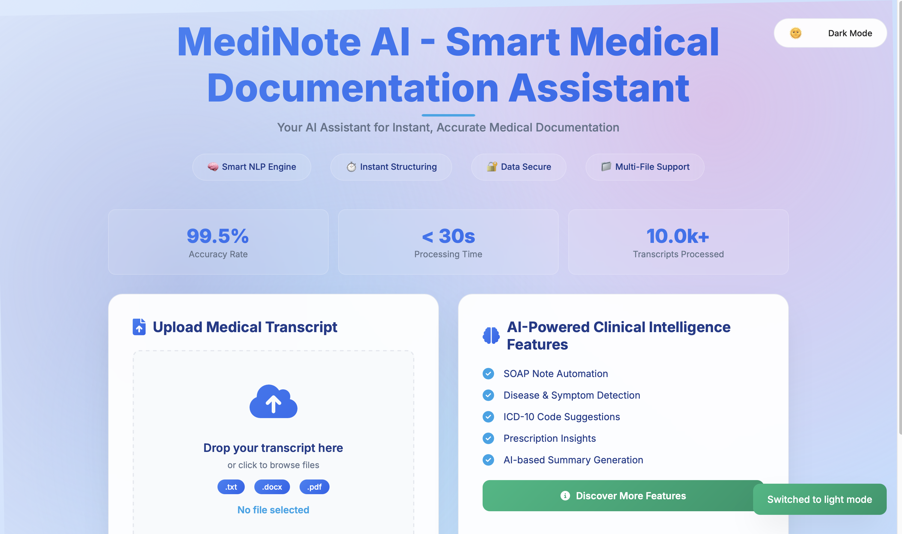

# 🩺 MediNote AI - Smart Medical Documentation Assistant

Transform messy doctor-patient conversations into structured medical notes using AI and NLP. Built for clinicians, researchers, and healthcare tech startups.

---



---

## 📂 Project Structure

```

├── core/                     # Python backend core logic
│   ├── combiner.py
│   ├── medical\_summarizer.py
│   ├── sentiment\_analyzer.py
│   └── soap\_generator.py
├── frontend/                 # Web interface
│   ├── static/
│   │   ├── style.css
│   │   └── script.js
│   └── templates/
│       └── index.html
├── app.py                    # Flask entry point
├── utils.py                  # Utility/helper functions
├── requirements.txt
├── pyproject.toml
├── .env                      # Environment variables
├── vercel.json               # Deployment configuration (for Vercel)
├── README.md                 # You’re here!

````

---

## 🚀 Features

- 🧠 **Medical Summarization** – Extracts meaningful information from transcripts  
- 🧾 **SOAP Note Generator** – Converts inputs into Subjective, Objective, Assessment, and Plan format  
- 💬 **Sentiment Analysis** – Understands tone of interaction (e.g., patient mood)  
- 🔗 **Combiner Module** – Merges multiple transcript parts into cohesive documentation  
- 🎨 **Responsive Web UI** – Upload `.txt`, `.pdf`, `.docx` and see instant results  
- 🌙 **Dark/Light Theme Support**

---

## ⚙️ Installation & Local Setup

> Prerequisites: Python 3.8+, pip

### 🔧 1. Clone the Repository
```bash
git clone https://github.com/your-username/medinote-ai.git
cd medinote-ai
````

### 📦 2. Create Virtual Environment & Install Dependencies

```bash
python -m venv venv
source venv/bin/activate  # On Windows: venv\Scripts\activate
pip install -r requirements.txt
```

### ⚙️ 3. Start the Flask App

```bash
python app.py
```

Open your browser at: `http://localhost:5000`

---

## 🧠 Methodologies & Architecture

### 🔹 `core/medical_summarizer.py`

* Uses **transformer-based NLP models** or rule-based logic (depending on setup) to extract:

  * Chief complaint
  * History of present illness
  * Diagnosis and follow-up instructions

### 🔹 `core/soap_generator.py`

* Converts raw or summarized text into **SOAP (Subjective, Objective, Assessment, Plan)** format using NLP pattern matching and section tagging.

### 🔹 `core/sentiment_analyzer.py`

* Uses VADER/ TextBlob (or custom model) to determine:

  * Patient sentiment
  * Urgency level
  * Emotional markers (stress, concern)

### 🔹 `core/combiner.py`

* Merges summaries, tags, and insights into a unified structure before sending back to UI as JSON.

---

## 🖼️ Sample Output Screenshot


* Output includes SOAP note, tags, ICD-10 hints, and sentiment.

---

## 🔒 Security & Compliance

* Local-only file processing (no cloud storage)
* HIPAA-conscious logic: Files are discarded after analysis
* Configurable `.env` for future cloud support with encryption

---

## 🌍 Deployment

This project supports deployment via:

* **Vercel** (using `vercel.json`)
* **Render / Railway**
* **Self-hosted VPS**

---

## 📌 Future Roadmap

* [ ] Audio transcription support
* [ ] Real-time SOAP note suggestions
* [ ] Integration with Electronic Health Records (EHR)
* [ ] Multi-language support (Hindi, German, etc.)

---

## 🤝 Contributing

Feel free to fork, submit PRs, or open issues!
We're actively looking to improve NLP accuracy and UI/UX.

---
